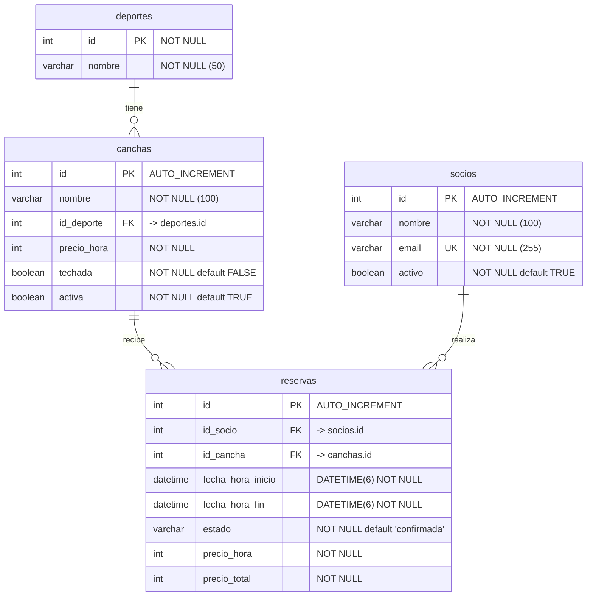

# Esquema de la base de datos

Diagrama entidad-relación de la base (MySQL). Fuente de verdad: [`ddl.sql`](ddl.sql) y [`dml.sql`](dml.sql).

```mermaid
erDiagram
    deportes {
        int     id      PK "NOT NULL"
        varchar nombre     "NOT NULL (50)"
    }

    canchas {
        int     id          PK "AUTO_INCREMENT"
        varchar nombre         "NOT NULL (100)"
        int     id_deporte  FK "-> deportes.id"
        int     precio_hora    "NOT NULL"
        boolean techada        "NOT NULL default FALSE"
        boolean activa         "NOT NULL default TRUE"
    }

    socios {
        int     id      PK "AUTO_INCREMENT"
        varchar nombre     "NOT NULL (100)"
        varchar email   UK "NOT NULL (255)"
        boolean activo     "NOT NULL default TRUE"
    }

    reservas {
        int      id                PK "AUTO_INCREMENT"
        int      id_socio       FK "-> socios.id"
        int      id_cancha      FK "-> canchas.id"
        datetime fecha_hora_inicio "DATETIME(6) NOT NULL"
        datetime fecha_hora_fin    "DATETIME(6) NOT NULL"
        varchar  estado            "NOT NULL default 'confirmada'"
        int      precio_hora       "NOT NULL"
        int      precio_total      "NOT NULL"
    }

    deportes ||--o{ canchas   : "tiene"
    canchas  ||--o{ reservas  : "recibe"
    socios   ||--o{ reservas  : "realiza"
```
